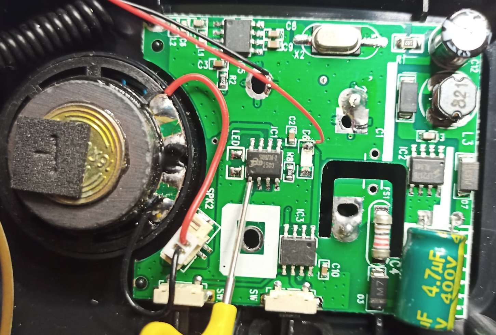

Alternative firmware for Cacazi doorbell
===

This firmware is written for the ATTiny412 and requires the original MCU to be replaced.
The functionality is almost identical to the original, with added support for HT12 style remotes.
The MCU is the rightmost 8 pins chip, pin 1 is the uppermost on the left.

🔥⚡⚠ WARNING ⚠⚡🔥
---
The doorbell is powered from mains, so this modification is <ins>not recommended</ins> if you don't know what you are doing. Incorrect procedures may lead to fires and/or electrocution.

The wires visible in the pictures were used for powering the doorbell while the firmware was under development. They <ins>must</ins> be removed and the box safely <ins>closed with screws</ins> **before** connecting the doorbell to a mains socket.